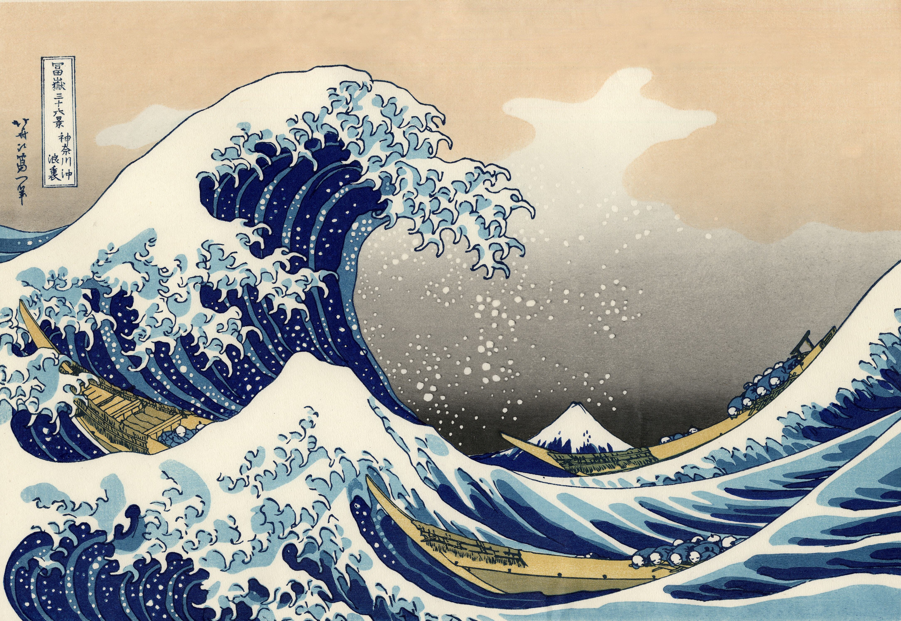
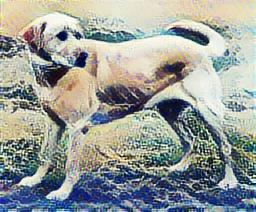

# Study of style transfer in images using tensorflow

This project was developed to learn about tensorflow and learning transfer, all content can be found on the site tensorflow. Imagine changing the style of an image according to your preference... That's what we're going to do in this repository!

First, clone the project and create your virtual environment. After that, install the requirements with the libs necessary for the project to work.

To execute your own tests, download the images to the `images` folder, change the variables `content_image` to `style_image` to your notebook, with `style_image` being the style that will be used as a base and `content_image` being the original image in which the style will be changed.

## Examples

## References

- [Neural Style Transfer](https://www.tensorflow.org/tutorials/generative/style_transfer)
- [Fast Style Transfer for Arbitrary Styles ](https://www.tensorflow.org/hub/tutorials/tf2_arbitrary_image_stylization)